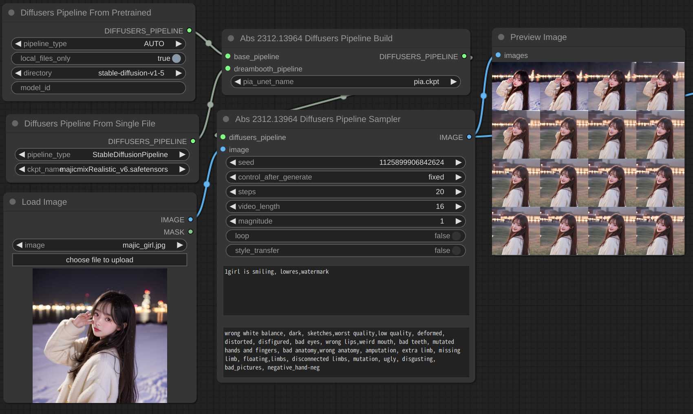
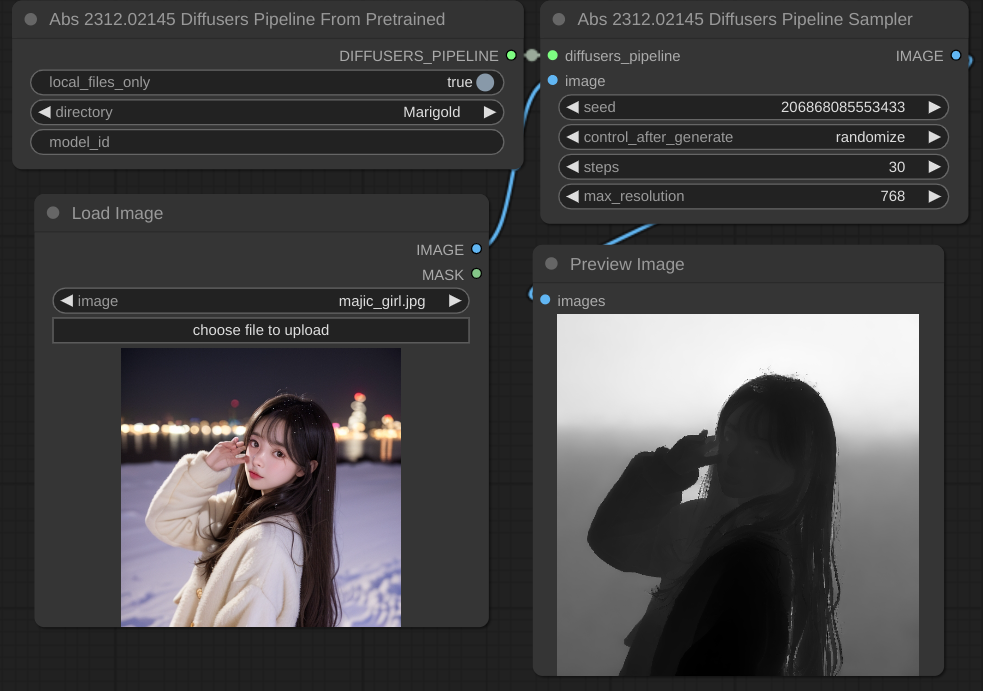

# ComfyUI paper playground

Evaluate some papers in ComfyUI, just playground.

# Play

First of all, this is a very experimental repo, and a lot of APIs or nodes may change in the future.

## Create your node

This repo use decorator to create and register the node.  
You can put the node file under the `module/comfy/node/` folder , paper repo to `module/paper/`.  
Than import you node at [module/comfy/\_\_init\_\_.py](module/comfy/__init__.py).  
example node

```python
import typing

from ..registry import register_node
from ..types import ComboWidget, gen_simple_new_type, new_widget, ComfyWidgetType
from ..types import BoolType, StringWidget  # some base comfyui type


class ExampleWidget(ComfyWidgetType):
    TYPE = "EXAMPLE"  # identifier of comfyui type.


ExampleType = typing.Annotated[bool, ExampleWidget()]  # TypeAlias , use as bool

SimpleType = gen_simple_new_type(str, "SIMPLE")  # Simple TypeAlias without definition Widget, use as str
"""Simple type doc"""

@register_node(
    identifier="node_identifier",  # identifier of node. If not provided, it will be generated from the function name.
    display_name="display_name",  # display_name show to user. it will be generated from the identifier.
    category="loaders",  # category under playground.
)
def example(
    widget_input1: StringWidget(),  # use widget instance as type hint , register_node will convert it to an inputType. but it is not valid for programmers.
    input1: BoolType,  # use Annotated type , This is the recommended way.
    input2: BoolType = True,  # you can set defult value.
    op_input1: typing.Annotated[BoolType, new_widget(BoolType, is_required=False)] = True,  # change widget property.
    combo_input0: typing.Annotated[
        str, ComboWidget(choices=["int"])
    ] = None,  # use Combo widget to select an item from the list.
    combo_input1: typing.Annotated[
        type, ComboWidget(choices={"int": int})
    ] = None,  # with dict choices Combo widget will automatically convert key to value .
    combo_input2: typing.Annotated[
        type, ComboWidget(choices=lambda: {"int": int})
    ] = None,  # with lambda Combo widget will update list when web page refresh.
    combo_input3: typing.Annotated[
        typing.Optional[type], ComboWidget(choices=lambda: {"int": int}, ext_none_choice="none")
    ] = None,  # you can set an extra None option name, which is converted to None when passed in.
) -> tuple[ExampleType,SimpleType,]:  # return type
    # do what you want.
    pass
```

## IP-Adapter

Put https://huggingface.co/h94/IP-Adapter to `ComfyUI/models/diffusers/IP-Adapter`.

# Paper

## [PIA：Personalized Image Animator](https://github.com/open-mmlab/PIA)

Put PIA Checkpoint to `ComfyUI/models/playground/paper/arxiv/abs2312_13964/pia/pia.ckpt`.  
Put https://huggingface.co/runwayml/stable-diffusion-v1-5 to `ComfyUI/models/diffusers/stable-diffusion-v1-5`.  
Put majicmixRealistic(https://civitai.com/models/43331) model to `ComfyUI/models/checkpoints/`.

### Example



## [Marigold: Repurposing Diffusion-Based Image Generators for Monocular Depth Estimation](https://github.com/prs-eth/Marigold)

Put https://huggingface.co/Bingxin/Marigold to `ComfyUI/models/diffusers/Marigold`.

### Example



## [HybrIK: Hybrid Analytical-Neural Inverse Kinematics for Body Mesh Recovery](https://github.com/Jeff-sjtu/HybrIK)

Refer to the README.

```bash
pip install "git+https://github.com/facebookresearch/pytorch3d.git"
```

Unzip model_files to directory `ComfyUI/models/playground/paper/arxiv/abs2304_05690/` .  
Put HybrIK-X rle model to `ComfyUI/models/playground/paper/arxiv/abs2304_05690/hybrikx/`.
